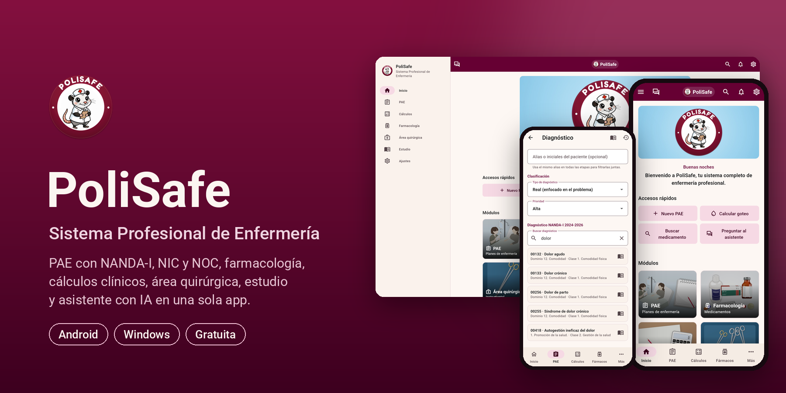
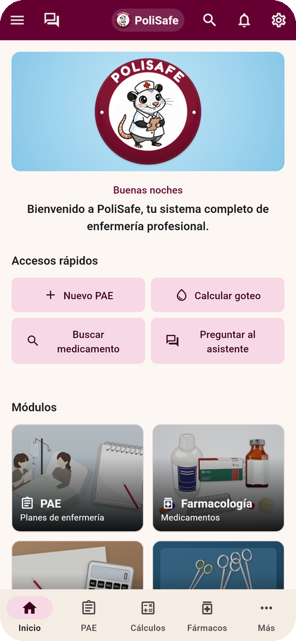
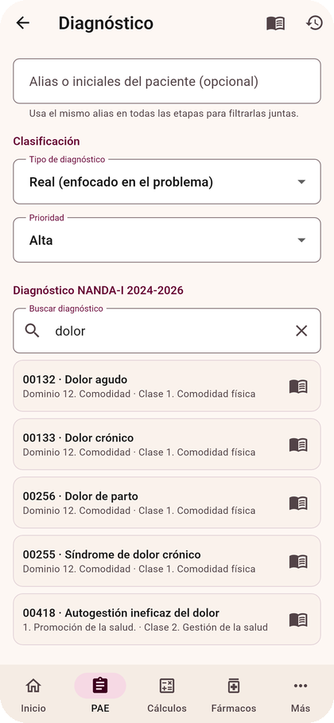
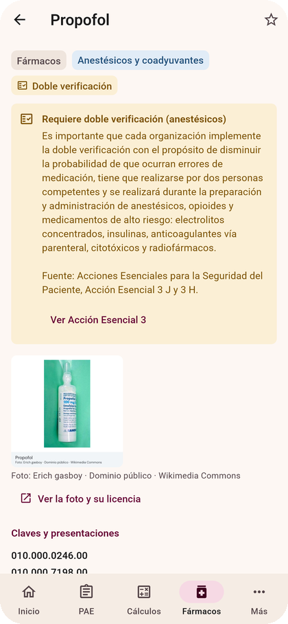
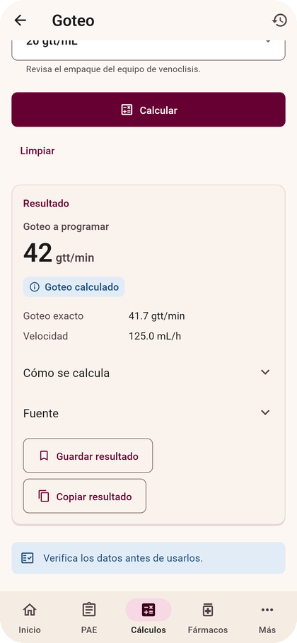
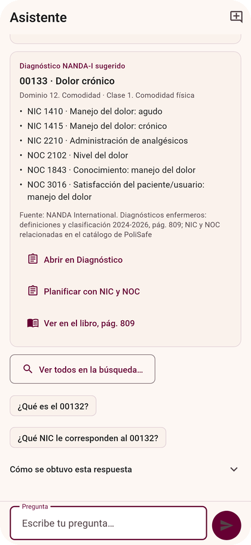
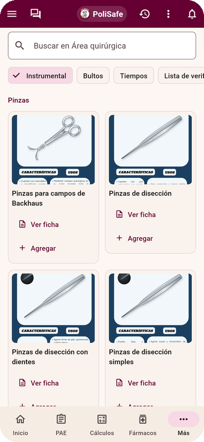
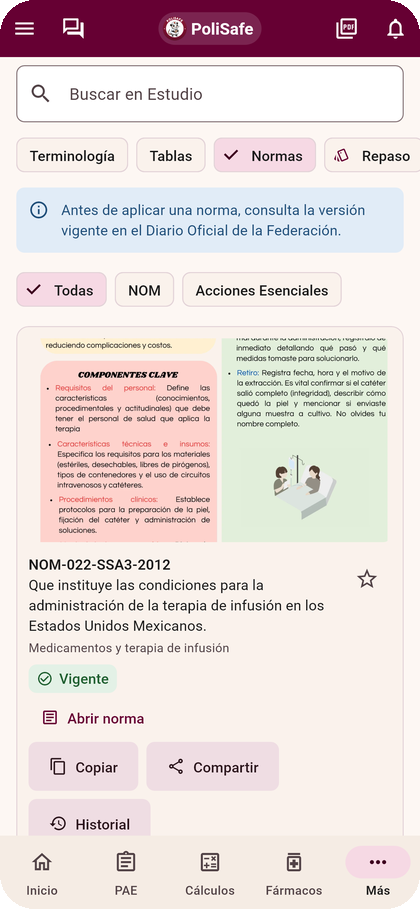
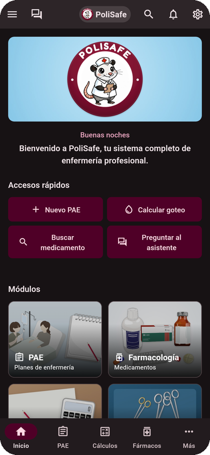
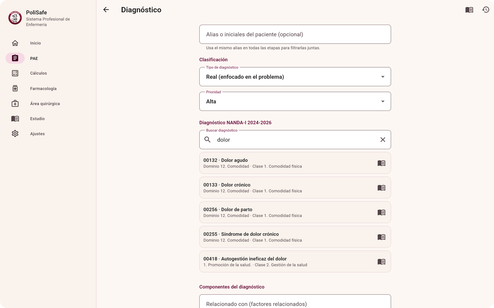

  

 

&nbsp;

&nbsp;

---

## Qué es PoliSafe

PoliSafe reúne en una sola app lo que una enfermera o un estudiante de enfermería consulta durante su formación y su práctica: el Proceso de Atención de Enfermería con los catálogos NANDA-I, NIC y NOC, fichas de medicamentos, cálculos clínicos con su fórmula y fuente, el área quirúrgica, material de estudio y un asistente con IA que responde con base en ese mismo contenido verificado.

Funciona en Android y Windows, es gratuita y los datos de práctica se quedan en el dispositivo.

<table>
  <tr>
    <td align="center" width="25%"><b>277</b> diagnósticos NANDA-I 2024-2026</td>
    <td align="center" width="25%"><b>614 · 612</b> intervenciones NIC · resultados NOC</td>
    <td align="center" width="25%"><b>155</b> medicamentos con monografía oficial</td>
    <td align="center" width="25%"><b>18</b> calculadoras clínicas con fuente</td>
  </tr>
</table>

## Capturas

<table>
  <tr>
    <td align="center"> Inicio</td>
    <td align="center"> PAE · Diagnóstico NANDA-I</td>
    <td align="center"> Farmacología</td>
    <td align="center"> Cálculos clínicos</td>
  </tr>
  <tr>
    <td align="center"> Asistente con IA</td>
    <td align="center"> Área quirúrgica</td>
    <td align="center"> Estudio · NOM</td>
    <td align="center"> Modo oscuro</td>
  </tr>
</table>

## Módulos

| Módulo | Qué ofrece |
|---|---|
| **Proceso de Atención de Enfermería** | Las cinco etapas del PAE con historial, búsqueda NANDA-I por código o texto, NOC y NIC relacionados, escalas EVA, Downton, Braden y Glasgow, y PDF institucional. |
| **Cálculos clínicos** | Signos vitales, dosis por peso, goteo, tiempo de infusión, balance hídrico, electrolitos, CKD-EPI 2021, Cockcroft-Gault e índice PaO₂/FiO₂. Cada resultado muestra unidades, interpretación, fórmula y fuente. |
| **Farmacología** | 155 fichas con la monografía del Compendio Nacional de Insumos para la Salud 2025, aviso de doble verificación en medicamentos de alto riesgo y favoritos por perfil. |
| **Área quirúrgica** | Instrumental, bultos y tiempos quirúrgicos, Lista de Verificación de la cirugía por fases, conteo de gasas y compresas, posiciones y funciones de instrumentista y circulante. |
| **Estudio** | 105 términos con fuente, tablas de referencia, 25 NOM y 8 Acciones Esenciales buscables, repaso con tarjetas y exportación a PDF o ZIP. |
| **Asistente con IA** | Responde preguntas de enfermería, analiza casos y propone diagnósticos NANDA-I con código verificado. Oculta nombres antes de enviar y, sin internet, responde con su motor local. |
| **Búsqueda global** | Un solo buscador para diagnósticos, intervenciones, medicamentos, normas, instrumental y calculadoras. Atajo `Ctrl+K` en escritorio. |
| **Perfiles y cuenta** | Hasta ocho perfiles por dispositivo con PIN o huella, tema claro u oscuro. La cuenta es opcional. |

## También en escritorio

La interfaz se adapta del teléfono a la pantalla completa de Windows, con barra lateral y atajos de teclado.

  

## Principios

- **Seguridad clínica.** Cada fórmula cita su fuente y cada resultado muestra unidades y rango.
- **Datos verificados.** Los catálogos NANDA-I, NIC y NOC se compararon contra los libros; lo que no tiene fuente no entra a la app.
- **Privacidad.** Los datos de práctica no salen del dispositivo. Sin analítica ni publicidad.
- **Criterio profesional.** PoliSafe apoya, no decide: toda sugerencia se revisa antes de usarse.

## Instalación

Descarga la versión más reciente desde [Releases](https://github.com/JosephT2244/Polisafe/releases/latest) o desde [polisafe.app/descargas](https://polisafe.app/descargas/). Cada archivo publica su SHA-256 para comprobar que llegó íntegro.

**Android**

1. Descarga `PoliSafe-x.y.z-android.apk`.
2. Ábrelo y permite la instalación desde esta fuente cuando Android lo pida.

**Windows (carpeta portable)**

1. Descarga `PoliSafe-x.y.z-windows-x64.zip` y extráelo completo.
2. Abre `polisafe.exe` sin separarlo de los archivos que lo acompañan.
3. Si SmartScreen muestra un aviso, elige *Más información > Ejecutar de todas formas* después de comprobar el SHA-256.

## Tecnología

| | |
|---|---|
| App | Flutter y Dart, un solo código para Android y Windows |
| Cuenta | Firebase Authentication (opcional) |
| Asistente | Motor local verificable y modelo de IA en la nube mediante un servidor intermedio que protege la clave |
| Sitio | [polisafe.app](https://polisafe.app/), construido con Astro |
| Calidad | Desarrollo guiado por especificaciones, análisis estático sin avisos y cerca de 700 pruebas automatizadas por versión |

## Equipo

PoliSafe fue creada por estudiantes durante su estancia de estudios en diversas escuelas del Instituto Politécnico Nacional.

| Integrante | Rol |
|---|---|
| Joseph Ubaldo Trejo Hernández | Fundador y desarrollador |
| Sofía Cruz García | Cocreadora y consultora de enfermería |
| Fernando Lima Sánchez | Cocreador |
| Ernesto Álvarez Hernández | Cocreador |
| María Guadalupe Cortés Cano | Cocreadora y consultora de enfermería |

Contacto: [polisafe@polisafe.app](mailto:polisafe@polisafe.app)

---

PoliSafe es material de apoyo para estudio y consulta. No sustituye el juicio clínico, la indicación médica ni los protocolos de la institución.

© 2026 Equipo PoliSafe

